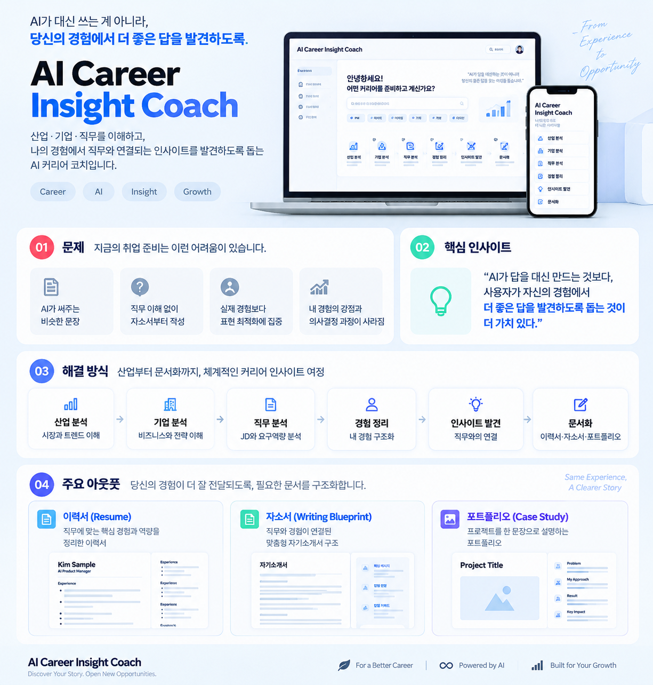

# AI Career Insight Coach

[웹앱 사용하기](https://career-insight-coach.vercel.app/coach) · [GitHub 저장소](https://github.com/kordp888/career-insight-coach)

관심 산업, 기업, 실제 채용공고와 자신의 경험을 입력하고 AI 분석 결과를 확인하는 커리어 작업 공간입니다. 경험에서 직무와 연결되는 근거를 찾고, 직접 선택한 인사이트를 이력서·자기소개서·포트폴리오로 정리합니다.



## 사용 순서

1. 관심 산업과 지원 직무를 입력해 산업 구조와 변화를 정리합니다.
2. 기업명과 참고자료를 붙여넣어 기업 분석을 요청합니다.
3. 채용공고 전체를 붙여넣어 업무, 역량, 경험 탐색 질문을 확인합니다.
4. 경험을 1~10개 등록하고 AI의 추가 질문에 답하며 근거를 보완합니다.
5. 직무 역량과 관련 경험의 연결 근거를 확인합니다.
6. 인사이트를 사용, 수정, 제외 중에서 선택합니다.
7. 선택한 경험과 인사이트로 문서를 작성하고 직접 수정합니다.

이력서는 항목별 문장 수정과 복사를 지원합니다. 자기소개서는 실제 질문과 글자 수를 입력하고 Writing Blueprint를 확인한 다음, 초안 작성을 눌러야 본문이 생성됩니다. 포트폴리오는 선택한 프로젝트를 문제, 판단, 실행, 결과 중심의 Case Study로 정리합니다.

## 데이터와 AI 사용

입력한 정보는 이 브라우저에 저장됩니다. 설정에서 JSON 파일 내보내기, 불러오기, 전체 삭제를 할 수 있습니다. 로그인과 데이터베이스는 사용하지 않습니다.

AI 분석 버튼을 누르면 입력 내용이 서버 AI 분석 API로 전달됩니다. 주민등록번호, 계좌번호, 비밀번호, API key를 넣지 마세요. 내보낸 파일에도 본인이 입력한 내용이 담기므로 안전하게 보관하세요.

AI 분석이 실패하면 오류가 표시됩니다. 예시 데이터는 사용자가 **예시로 둘러보기**를 선택했을 때만 열리며, 실제 작업 공간과 별도로 저장됩니다. 예시 화면에는 예시 데이터 표시가 붙습니다.

분석은 입력된 정보와 AI 지식을 바탕으로 합니다. 실시간 시장 조사, 합격 가능성, 직무 적합도 점수를 제공하지 않습니다. 지원 전에 사실과 수치를 직접 확인하세요.

## 경로

작업 공간은 `/coach`입니다. 기존 `/demo/*` 링크는 대응하는 `/coach/*`로 이동합니다. `/api/status`는 AI 연결 상태를, `/api/version`은 배포 커밋과 환경을 표시합니다.

## 로컬 실행

```bash
npm ci
npm run dev
```

```bash
npm test
npm run lint
npm run build
```

공개 저장소에는 제품 화면, 공개 인터페이스, 템플릿과 가상의 예시만 포함합니다. 실제 지원자 자료나 AI API 키를 커밋하지 않습니다.

## 사용 기술

Next.js, React, TypeScript, Tailwind CSS, Vercel, browser localStorage.

## 제작 범위와 학습 배경

문제 정의, 제품 기획, 사용자 경험 설계, 웹앱 구현과 배포를 담당한 개인 프로젝트입니다. SeSAC AI PM 과정에서 배운 산업·기업·직무 분석과 사용자 관점의 제품 설계 방법을 확장했습니다.

[제품 개요](docs/product-overview.md) · [경험 정리 템플릿](templates/experience-journal.md) · [포트폴리오 템플릿](templates/portfolio-case-study.md)

면접 준비와 BYOK는 구현하지 않았습니다. [향후 계획](ROADMAP.md)을 참고하세요.

## License

[MIT License](LICENSE). 이 저장소에 포함된 공개 파일에 한해 적용됩니다.
