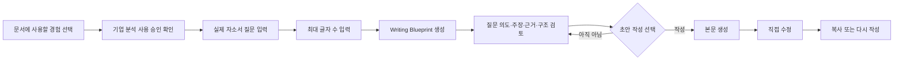
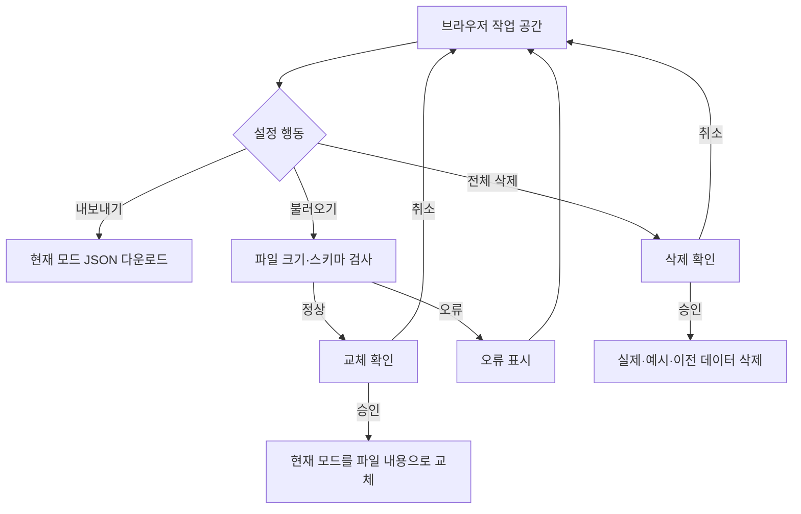
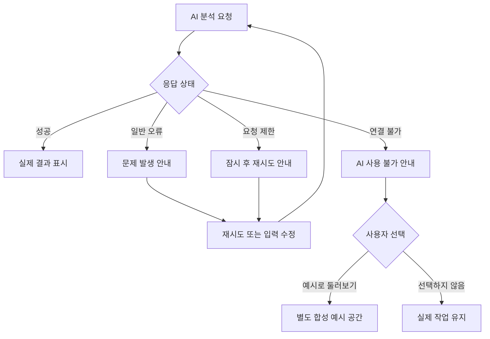

# 유저플로우

## 전체 흐름

```mermaid
flowchart TD
    A[랜딩 또는 직접 링크] --> B[/coach 작업 공간]
    B --> C{사용 방식 선택}
    C -->|경험 하나 이야기하기| I[경험 대화: 한 번에 질문 하나]
    C -->|예시로 둘러보기| S[합성 예시 공간]
    S --> B
    I --> I2[경험 카드: 사용자 진술 / 첨부 근거 / AI 해석]
    I2 --> D[관심 직무·기업 입력 (선택)]
    D --> E[산업 분석 + 의미 질문]
    E --> F[기업 분석 + 의미 질문]
    F --> G[기업 분석 사용 승인]
    G --> H[JD 분석 + 경험 탐색 질문]
    H --> J[경험 보완 질문·추가 대화]
    J --> K[경험과 직무 역량 연결]
    K --> L[인사이트 후보 생성]
    L --> M{사용자 결정}
    M -->|사용| N[승인 인사이트]
    M -->|수정| L
    M -->|제외| O[문서 입력에서 제외]
    N --> P[문서화]
    P --> Q[이력서]
    P --> R[자기소개서 설계안]
    R --> T[사용자가 초안 작성 선택]
    T --> U[자기소개서 초안]
    P --> V[포트폴리오 Case Study]
    Q --> W[직접 수정·복사]
    U --> W
    V --> W
```

## 실제 사용자 정상 흐름

| 순서 | 사용자 행동 | 제품 반응 | 저장되는 결과 |
|---:|---|---|---|
| 0 | 경험 하나 이야기 | 코치가 한 번에 질문 하나, 답변은 사용자 진술로 저장 | 경험 카드·대화 기록 |
| 1 | 관심 직무와 기업 입력 (선택) | 이후 분석과 질문의 관점으로 사용 | 지원 대상 |
| 2 | 관심 산업 입력 후 분석 | 요약·상세·근거 범위·사회적 의미·의미 질문 표시 | 산업 분석·의미 답변 |
| 3 | 기업 자료 붙여넣기 후 분석 | 기업·서비스·직무 연결 표시 | 기업 분석 |
| 4 | 기업 분석 사용 승인 | 문서 입력 후보로 활성화 | 승인 상태 |
| 5 | JD 전체 붙여넣기 후 분석 | 업무·역량·키워드·질문 표시 | JD 분석 |
| 6 | 경험 1~10개 입력 | 경험 탭과 편집 폼 표시 | 경험 목록 |
| 7 | 경험 보완 질문 요청 | 경험별 추가 질문 표시 | 질문 목록 |
| 8 | 경험 내용 보완 | 수정 즉시 브라우저 저장 | 갱신된 경험 |
| 9 | 직무 연결 요청 | 역량별 경험·근거·질문 표시 | 연결 결과 |
| 10 | 인사이트 생성 | 확인 전 후보 표시 | 인사이트 후보 |
| 11 | 사용·수정·제외 결정 | 승인 개수와 상태 갱신 | 사용자 결정 |
| 12 | 문서 종류 선택 | 생성 조건과 사용할 정보 표시 | 문서 선택 |
| 13 | 문서 생성 | 편집 가능한 결과 표시 | 문서 결과 |
| 14 | 직접 수정·복사 | 수정 결과 저장 | 최종 편집본 |

## 자기소개서 흐름



## 데이터 이동 흐름



## 오류 흐름



오류가 발생해도 실제 입력과 기존 결과를 지우지 않습니다. 제품이 예시 공간으로 자동 이동하는
경로는 없습니다.

## 선행 조건과 막힘 처리

| 진입 화면 | 부족한 조건 | 처리 |
|---|---|---|
| 시작 | 지원 직무 없음 | 분석 시작 버튼 비활성 |
| 역량 연결 | JD 분석 또는 경험 없음 | 선행 작업 안내와 JD 분석 이동 버튼 |
| 인사이트 | JD 또는 경험 없음 | 생성 버튼 비활성 |
| 문서 생성 | 선택 경험 없음 | 경험 선택 요구 |
| 문서 생성 | 승인 인사이트 없음 | 인사이트 선택 요구 |
| 문서 생성 | 기업 분석은 있으나 미승인 | 사용 동의 확인 요구 |
| 자기소개서 | 질문 없음 | 설계안 버튼 비활성 |

## 복귀 흐름

1. 사용자는 왼쪽 탐색과 단계 표시에서 이전 화면으로 이동할 수 있습니다.
2. 같은 브라우저에서는 마지막 실제 작업이 복원됩니다.
3. 예시 공간에서 `내 작업으로 돌아가기`를 누르면 기존 실제 작업으로 복귀합니다.
4. 다른 브라우저나 기기에서는 내보낸 JSON을 불러와야 합니다.
5. 스키마가 맞지 않는 파일은 복귀 수단으로 사용하지 않고 기존 작업을 유지합니다.

## 분석 결과를 바꾸는 경우

| 변경 | 다시 검토할 결과 |
|---|---|
| 지원 대상 변경 | 기업 승인, 연결, 인사이트, 문서 |
| 기업 자료 변경 | 기업 분석과 사용 승인 |
| JD 변경 | JD 분석, 연결, 인사이트, 문서 |
| 경험 변경 | 보완 질문, 연결, 인사이트, 문서 |
| 인사이트 수정 | 해당 인사이트 승인, 문서 |
| 문서용 경험 선택 변경 | 이력서·자소서·포트폴리오 |

## v1.1 계측 지점

원문이나 AI 결과를 수집하지 않는 조건으로 다음 이벤트만 검토합니다.

`actual_started`, `industry_completed`, `company_completed`, `job_completed`,
`experience_added`, `connection_completed`, `insight_accepted`, `document_generated`,
`ai_error_shown`, `export_completed`

각 이벤트는 시간, 화면, 성공 여부만 다룹니다. 기업명, JD, 경험 본문, 생성 문장은 수집하지 않습니다.
